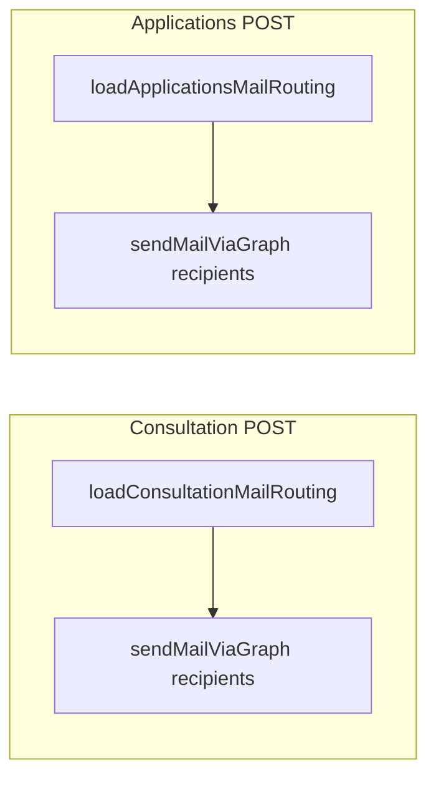

# Second inbox + delivery choice: consultations and job applications (independent)

## Goals

1. **Consultation form** delivery: optional **second inbox** plus a choice to send to **primary only**, **second only**, or **both**.
2. **Job application** notifications: same pattern (**independent** settings), reusing the existing applications primary/fallback behavior where applicable.

The two flows do **not** share one delivery mode; each has its own addresses and mode.

## Configuration keys (Microsoft 365 / Admin)

### Consultations

| Key | Purpose |
|-----|---------|
| `MS365_MAIL_FROM` | Send-as (existing). |
| `MS365_MAIL_TO` | Primary consultation inbox (existing; blank = send-as). |
| **`MS365_MAIL_TO_2`** (new) | Second consultation inbox (optional). |
| **`MS365_CONSULTATION_DELIVERY`** (new) | `primary` \| `secondary` \| `both` — which address(es) receive consultation submissions. |

**Primary resolution for consults** (unchanged conceptually): primary = `MS365_MAIL_TO` or send-as if primary blank.

### Job applications

| Key | Purpose |
|-----|---------|
| `MS365_APPLICATIONS_MAIL_TO` | Primary applications inbox (existing). |
| **`MS365_APPLICATIONS_MAIL_TO_2`** (new) | Second applications inbox (optional). |
| **`MS365_APPLICATIONS_DELIVERY`** (new) | `primary` \| `secondary` \| `both`. |

**Primary resolution for applications** (existing chain): `MS365_APPLICATIONS_MAIL_TO` → else `MS365_MAIL_TO` → else send-as.

### Delivery mode semantics (same for both flows)

- **`primary`** — only the resolved **primary** address for that flow.
- **`secondary`** — only **`…_MAIL_TO_2`** for that flow; if empty, **fallback to primary** and log warning.
- **`both`** — TO = primary + secondary when both non-empty; dedupe; if second empty, **primary only** + optional warning.

## Admin UI ([`MS365SettingsForm.tsx`](apps/web/src/components/admin/MS365SettingsForm.tsx))

- **Email (Microsoft Graph)** section:
  - Group **Consultation**: `MS365_MAIL_FROM`, `MS365_MAIL_TO`, new **`MS365_MAIL_TO_2`**, select **`MS365_CONSULTATION_DELIVERY`**.
  - Group **Job applications**: `MS365_APPLICATIONS_MAIL_TO`, new **`MS365_APPLICATIONS_MAIL_TO_2`**, select **`MS365_APPLICATIONS_DELIVERY`**.
- Helper text clarifies second field is required when mode is second-only or both (for meaningful delivery).

## Code touchpoints

- [`mailRouting.ts`](apps/web/src/lib/mailRouting.ts):  
  - `loadConsultationMailRouting()` → `{ sendAs, recipients: string[] }` (or equivalent) using consult keys + mode.  
  - `loadApplicationsMailRouting()` → same shape using application keys + mode.  
  - Shared internal helper e.g. `resolveRecipients({ primary, secondary, mode, fallbackPrimary })` to avoid duplication.
- [`ms365.ts`](apps/web/src/lib/ms365.ts): `sendMailViaGraph` accepts **one or many** TO addresses (single `recipients: string[]` param or `to` + optional extras — pick one API and update all call sites).
- [`consultation/route.ts`](apps/web/src/app/api/consultation/route.ts): use consultation routing result for `toRecipients`.
- [`applications/route.ts`](apps/web/src/app/api/applications/route.ts): use applications routing result (replaces current single `notifyInbox`).

## Diagram

## Edge cases

- Dedupe addresses case-insensitively after trim if desired.
- Invalid or empty stored mode: default to **`primary`** in code.

## Non-goals

- CC/BCC separate from TO (not required).
