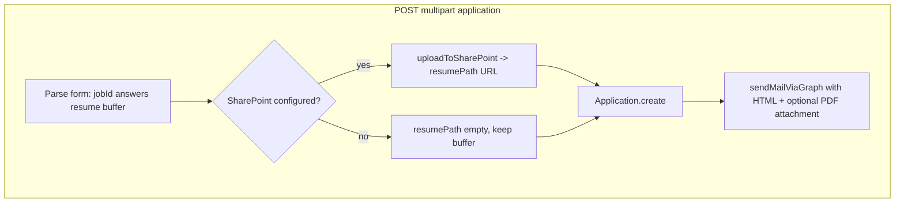

# SharePoint optional: email with PDF + job/applicant details

## Goal

- If **SharePoint is not configured** (`getMS365Config()` is null), **do not fail** the application submit.
- **Still persist** the application in MongoDB (`resumePath` may be empty).
- **Send notification email** with:
  - **PDF attached** when the applicant uploaded a resume (same file bytes as today).
  - **Clear details**: which job (title, location, job id), **who is applying** from **logged-in Auth0 session** (`session.user.name`, `session.user.email`, and optionally `session.user.sub` for internal reference).

## Current behavior (problem)

[`apps/web/src/app/api/applications/route.ts`](apps/web/src/app/api/applications/route.ts) calls `uploadToSharePoint` **before** `Application.create`. If `getMS365Config()` is incomplete (e.g. missing `MS365_SHAREPOINT_SITE_ID`), `uploadToSharePoint` throws and the applicant never gets saved and no email runs.

## Target behavior

- **SharePoint configured**: same as now — upload, set `resumePath`, attach PDF to email (or rely on attachment only; body can still link if URL exists).
- **SharePoint not configured**: skip upload, `resumePath = ''`, attach PDF to email if buffer present; HTML explains resume is attached (no SharePoint link).

## Implementation notes

1. **Detect config without throwing**  
   - Export a small helper from [`apps/web/src/lib/ms365.ts`](apps/web/src/lib/ms365.ts) (e.g. `isSharePointUploadConfigured(): Promise<boolean>`) that mirrors `getMS365Config()` success criteria, **or** catch the specific error — prefer explicit boolean to avoid relying on exception flow.

2. **POST handler branch**  
   - If multipart with resume file:
     - If SharePoint ready: `resumePath = await uploadToSharePoint(...)` (existing).
     - Else: keep `resumeAttachment` buffer, `resumePath = ''`.
   - Always proceed to `Application.create` with `answers` and `resumePath`.

3. **Notification email** (existing block after create)  
   - Already uses [`sendMailViaGraph`](apps/web/src/lib/ms365.ts) with [`buildJobApplicationEmailHtml`](apps/web/src/app/api/applications/route.ts) and attachments from `resumeAttachment`.
   - **Enrich HTML** so it clearly states:
     - Applicant display name and email from `session.user` (and optional “Account ID: …” using `session.user.sub` for admins).
     - Job: title, location, and canonical job id / link if useful (`getPublicSiteUrl()` + `/jobs/{jobId}`).
   - Ensure `pdfAttached` is true whenever a PDF buffer is sent, even without SharePoint.

4. **Edge cases**  
   - No resume file: no attachment; email still lists job + applicant from session.
   - Mail not configured: keep current behavior (log / skip) — optional follow-up to return a clear JSON warning; out of scope unless requested.

5. **Tests**  
   - Unit or integration test optional; manual verification: submit with SharePoint keys removed — expect 201 + email with attachment (if Graph mail keys present).

## Files to touch

- [`apps/web/src/lib/ms365.ts`](apps/web/src/lib/ms365.ts) — helper to test SharePoint config without throwing; optionally reuse in upload.
- [`apps/web/src/app/api/applications/route.ts`](apps/web/src/app/api/applications/route.ts) — conditional upload; enrich email HTML from session + job.

## Non-goals

- Changing Auth0 or frontend application form.
- Storing PDF in MongoDB (still attach via email only; DB stores path or empty).
